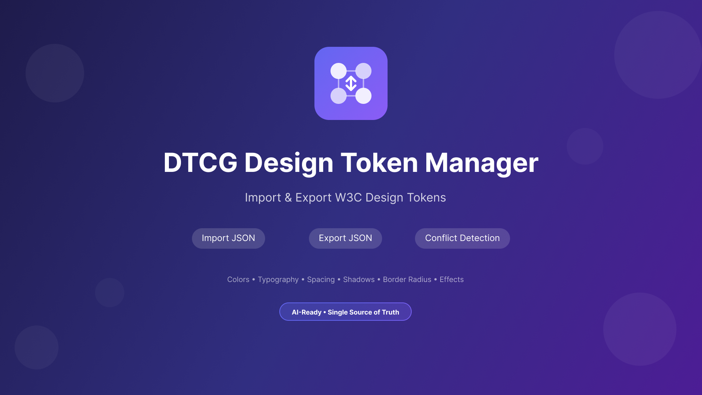

# DTCG Design Token Manager

A Figma plugin for importing and exporting [W3C Design Tokens Community Group (DTCG)](https://design-tokens.github.io/community-group/format/) format tokens.

## Demo


## Features

- **Import** DTCG JSON tokens into Figma Variables and Effect Styles
- **Export** Figma Variables and Effect Styles to DTCG JSON format
- **Conflict detection** with options to override or skip existing items
- Supports colors, typography, spacing, border, effects, and layout tokens
- Converts shadow tokens to Figma Effect Styles

## Installation

### From Figma Community
*(Coming soon)*

### Development Setup

1. Clone the repository:
   ```bash
   git clone https://github.com/your-username/figma-token.git
   cd figma-token
   ```

2. Install dependencies:
   ```bash
   npm install
   ```

3. Build the plugin:
   ```bash
   npm run build
   ```

4. In Figma, go to **Plugins > Development > Import plugin from manifest**
5. Select the `manifest.json` file from this project

## Usage

### Importing Tokens

1. Open the plugin in Figma
2. Paste your DTCG JSON into the text area, or click **Upload File** to select a JSON file
3. Click **Import Tokens**
4. If conflicts are detected (existing variables/styles with the same name), you'll be prompted to:
   - **Override** - Update this item
   - **Ignore** - Skip this item
   - **Override All** - Update all conflicting items
   - **Ignore All** - Skip all conflicting items

### Exporting Tokens

1. Click the **Export** button
2. Once complete, you can:
   - **Copy JSON** - Copy to clipboard
   - **Download** - Save as `tokens.json`

## Supported Token Types

| DTCG Type | Figma Type |
|-----------|------------|
| `color` | Color Variable |
| `dimension` | Float Variable |
| `fontFamily` | String Variable |
| `fontWeight` | Float Variable |
| `duration` | Float Variable |
| `number` | Float Variable |
| `shadow` | Effect Style (Drop Shadow) |

## Token Format Example

```json
{
  "color": {
    "$type": "color",
    "primary": {
      "500": { "$value": "#3B82F6" },
      "600": { "$value": "#2563EB" }
    }
  },
  "spacing": {
    "$type": "dimension",
    "sm": { "$value": "8px" },
    "md": { "$value": "16px" },
    "lg": { "$value": "24px" }
  },
  "shadow": {
    "$type": "shadow",
    "sm": {
      "$value": {
        "offsetX": "0px",
        "offsetY": "1px",
        "blur": "2px",
        "spread": "0px",
        "color": "#00000026"
      }
    }
  }
}
```

## Using Design Tokens with AI Agents

DTCG design tokens serve as an excellent **single source of truth** for AI coding agents like Claude, Cursor, or GitHub Copilot. By exporting your Figma design system to a `tokens.json` file and including it in your codebase, AI agents can:

- **Generate consistent UI code** that matches your exact design system
- **Reference correct color values, spacing, and typography** without guessing
- **Maintain design consistency** across AI-assisted code generation
- **Reduce back-and-forth** between design and development

### Recommended Workflow

1. Design your tokens in Figma using Variables
2. Export tokens using this plugin
3. Save `tokens.json` in your project (e.g., `src/tokens/tokens.json`)
4. Reference the tokens file when prompting AI agents:

```
Use the design tokens in src/tokens/tokens.json for all colors and spacing values.
```

This ensures AI-generated code aligns with your design system from the start.

### Alternative: Figma MCP

You can also use the [Figma MCP server](https://help.figma.com/hc/en-us/articles/32132100833559-Guide-to-the-Figma-MCP-server) to sync Figma variables directly into an AI agent's context. However, exporting to JSON is often preferable because:

- **Cheaper** - No API calls or real-time connections needed
- **Clearer** - Human-readable format that's easy to inspect and version control
- **Faster** - Tokens are immediately available without fetching
- **Portable** - Works with any AI tool, not just MCP-compatible ones

## Development

### Scripts

- `npm run build` - Build the plugin
- `npm run watch` - Watch for changes and rebuild

### Project Structure

```
├── src/
│   ├── code.ts          # Main plugin code
│   ├── ui.html          # Plugin UI
│   ├── types/           # TypeScript types
│   ├── parsers/         # Token value parsers
│   ├── creators/        # Figma variable/style creators
│   ├── exporters/       # JSON export functionality
│   └── utils/           # Utility functions
├── dist/                # Built files
├── manifest.json        # Figma plugin manifest
└── icon.svg            # Plugin icon
```

## License

MIT
